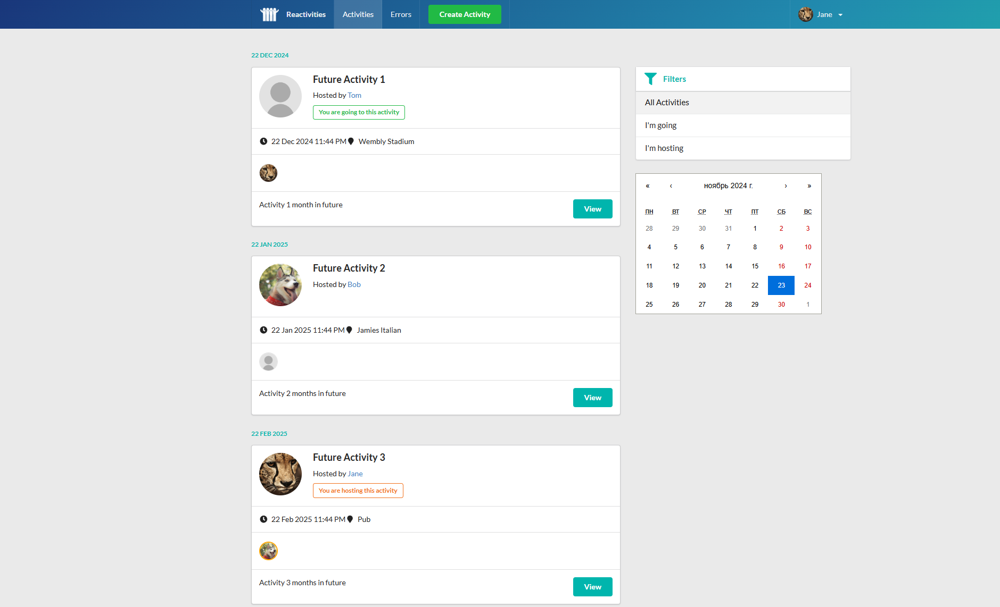

# Reactivities

Reactivities is a full-stack web application for managing and attending activities. It allows users to organize and participate in various group events, fostering collaboration and interaction.

Based on [this Udemy course](https://www.udemy.com/course/complete-guide-to-building-an-app-with-net-core-and-react), massively refactored afterwards.

## Features

- **Activity Management**: Create, view, and manage activities.
- **User Authentication**: Secure login and registration.
- **Activity Attendance**: Join or leave activities easily.
- **User follow**: Follow other users.
- **Chat**: Real-time chat in each activity.

## Tech stack

- **Backend**: ASP.NET Core (Web API), EntityFramework, SignalR, MediatR, FluentValidation
- **Frontend**: Node, React (TypeScript), Vite
- **Storage**: Postgres, Cloudinary
- **Development Tools**:
    -   **Backend**: Visual Studio (Windows)
    -   **Frontend**: Visual Studio Code (Cross-platform)

## How to run locally

### Prerequisites

- [Visual Studio](https://visualstudio.microsoft.com/)  (for backend development)
- [Visual Studio Code](https://code.visualstudio.com/)  (for frontend development)
- [Docker](https://www.docker.com/)  (optional but recommended for containerized development)
- [Node](https://nodejs.org/) (optional for frontend development without Docker)
- **Operating System**: There are a bunch of development scripts made for Windows only.

### Dev Folder Overview

- `Dev/Postman`: Contains Postman resources for testing the API. You can import these into Postman to streamline API interaction.
- `Dev/Scripts`:
    - `Dev/Scripts/Environment`: Scripts for setting up and managing the development environment (e.g., Dockerized databases).
    -   `Dev/Scripts/WebClient`: Scripts for developing the frontend in Docker. These eliminate the need to install Node.js locally.

### Setup

1.  **Clone the repository**:

`git clone https://github.com/yourusername/reactivities.git`
`cd reactivities` 

2.  **Backend**:

-   Open the  `Reactivities.Api/Reactivities.Api.sln` solution in Visual Studio.
-   Restore dependencies and build the project:
    -   From Visual Studio, press  `Ctrl + Shift + B`  or use the  `Build`  menu.
-   Run the project (using  `Ctrl + F5`).

3.  **Frontend**:

-   Use the scripts in `Dev/Scripts/WebClient`  to setup and run the React application in Docker:
`Dev\Scripts\WebClient\setup.bat`
`Dev\Scripts\WebClient\install_packages.bat`
`Dev\Scripts\WebClient\run_dev.bat`

-   If you prefer local development without Docker using Node 23:
`cd Reactivities.WebClient`
`npm install`
`npm run dev`

5.  **Access the Application**:

- **Backend**: Accessible at `https://localhost:6001`.
- **Frontend**: Visit  `http://localhost:3000` in your browser.

## Screenshots

